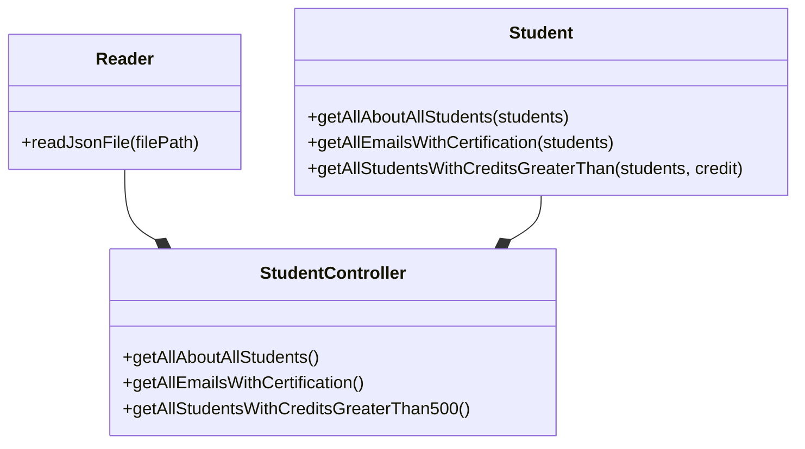

# Code Challenge

## Dependencias

1. `Jest` para las pruebas de unidad.
   - `npm install jest --save-dev`
2. `ESLint` para buscar y reparar problemas en el codigo.
   - `npm install eslint --save-dev`
   - `npm init @eslint/config`
3. `Express` crea e inicia un servidor.
   - `npm install express --save`

## Diseño

### Class Reader

Es la encargada de leer un archivo json, esta compuesta por un método estatico que recibe la ruta al archivo, para ser devuelto como un objeto de JavaScript.

### Class Student

Representa a los estudiantes, se comporne de varios metodos estáticos que filtran y obtienen información sobre los estudiantes, esta información se recibe como parametro en forma de objeto de JavaScript, para este ejemplo se usa un archivo JSON pero se podria usar una base de datos.

### Class StudentController

Actúa como intermediario entre la información que se tiene y la que se quiere mostrar, gestionando el flujo de información y las transformaciones para adaptar los datos a las necesidades de cada requerimiento.

## API
| Endpoint | Request | Response |
|---|---|---|
| `localhost:3000/v1/students/` | `localhost:3000/v1/students/` | Deberás obtener la lista de los estudiantes con todos sus campos. |
| `localhost:3000/v1/students/emails` | `localhost:3000/v1/students/emails` | Deberás obtener los emails de todos los estudiantes que tengan certificación `haveCertification=true`. |
| `localhost:3000/v1/students/credits` | `localhost:3000/v1/students/credits` | Deberás obtener la lista de los estudiantes que tengan `credits` mayor a 500 |
